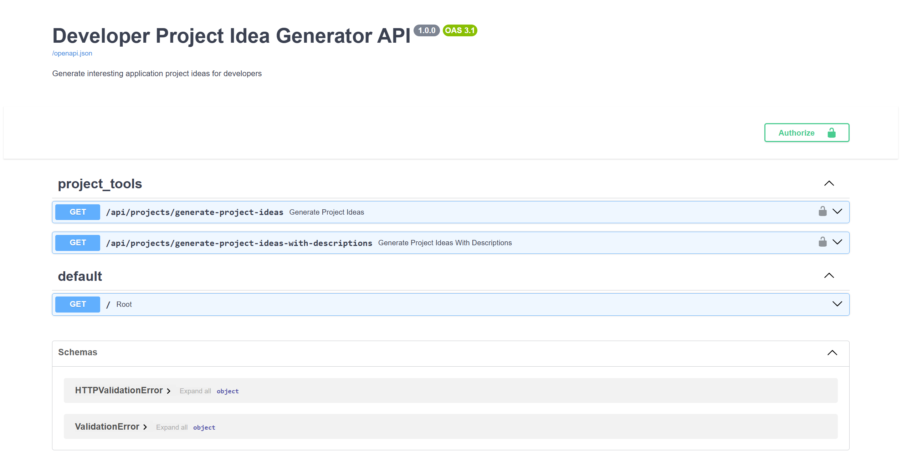
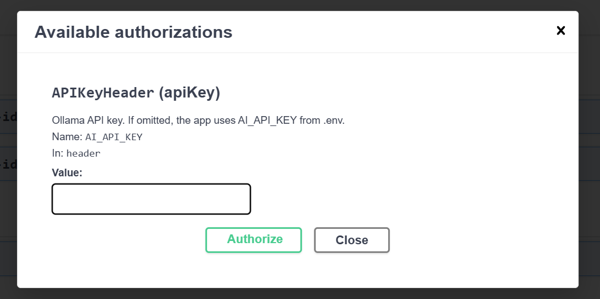

# Developer Project Idea Generator API

Setup:

Unix/macOS:
```bash
cp .env.example .env
```
Windows PowerShell:
```powershell
Copy-Item .env.example .env
```
Add your Ollama API key.

```powershell
pip install -r requirements.txt
```

Run locally:

```powershell
uvicorn main:app --reload
```

Open the API docs at:

```text
http://127.0.0.1:8000/docs
```

[To provide your Ollama API key from Swagger:](#interactive-api-documentation)

1. Open `/docs`.
2. Click `Authorize`.
3. Enter your key in the `AI_API_KEY` field.
4. Run either project endpoint.

You can also keep using `.env`; the Swagger key is only needed when `AI_API_KEY` is not set there, or when you want to override it for a request.

Endpoints:

- `/api/projects/generate-project-ideas?user_topic=YOUR_TOPIC`
- `/api/projects/generate-project-ideas-with-descriptions?project_idea=YOUR_TOPIC&tone=professional`

Run with Docker:

```bash
docker build -t fastapi-project-ideas .
docker run --env-file .env -p 8000:8000 fastapi-project-ideas
```

# Motivation: to be used as a tool for an AI assistant


## Features

- Generate 10 developer project ideas from any topic
- Generate project ideas with short descriptions
- Optional tone control for described ideas
- FastAPI interactive docs at `/docs`
- Structured JSON responses powered by Pydantic
- Ollama-backed LLM generation

## Example Requests

```text
GET /api/projects/generate-project-ideas?user_topic=AI tools for writers
GET /api/projects/generate-project-ideas-with-descriptions?project_idea=developer productivity tools&tone=professional
```

## Interactive API Documentation

[](https://github.com/martinIvovIv/fastapi-project--ideas-generator-ollama)
[](https://github.com/martinIvovIv/fastapi-project--ideas-generator-ollama)